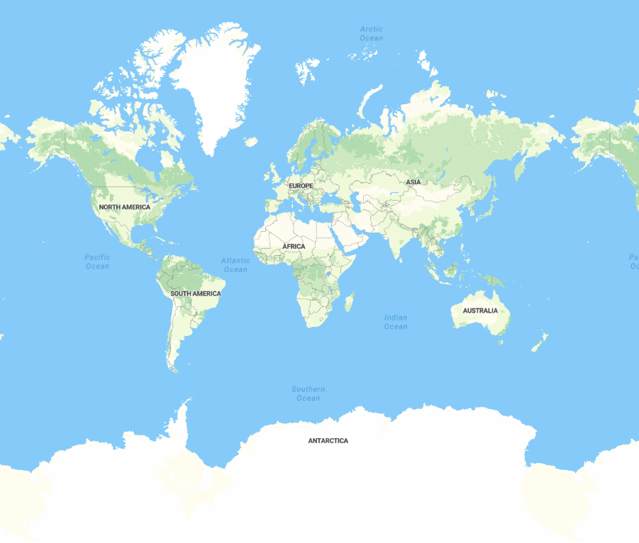
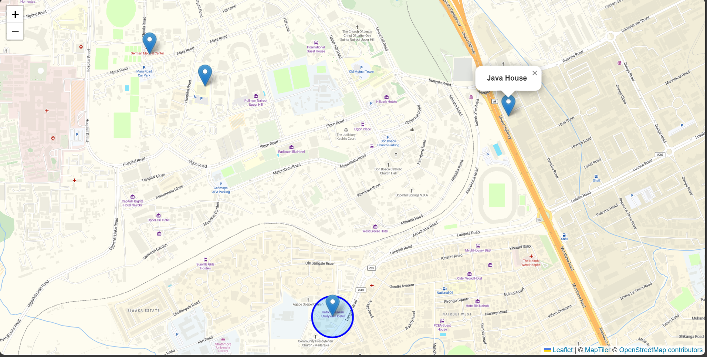

# Map Of the World by Benir

Map of the world is an open source project that enables users to check the nearest cafes within the area that the user is located.

Additionally, a user can view the Cafe's details, such as websites and even food that the cafe offers.

## The Earth

## A demo user location

